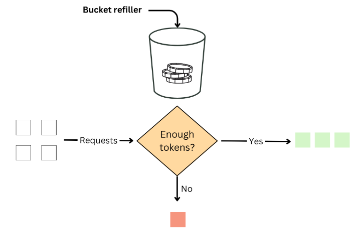
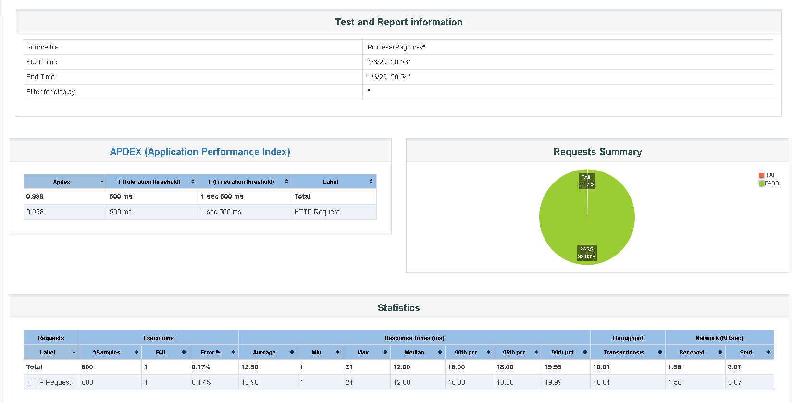
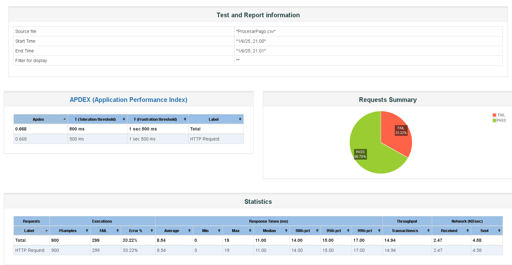

## 1 En esta seccion haremos un análisis de un **rate limiter** (limitador de tasa) basado en el patrón *Token Bucket*. 
Hacemos uso de la libreria pública de bucket4j
- Bucket4j es una biblioteca Java para limitación de tasa (rate-limiting) que está basada principalmente en el algoritmo de "token bucket", considerado el estándar de facto para la limitación de tasas en la industria de TI.
  


En nuestro código se define un Tocket bucket:


```
    private Bucket createBucket(int maxRequestsPerMinute) {
        Bandwidth bucketConf = Bandwidth.builder()
                .capacity(maxRequestsPerMinute)
                .refillGreedy(maxRequestsPerMinute, Duration.ofMinutes(1))
                .build();

        return Bucket.builder().addLimit(bucketConf).build();
    }
```

- Un **máximo de tokens disponibles por minuto**: `300`
- Cada solicitud consume un token; si no hay tokens, se retorna HTTP `429 Too Many Requests`.

---

## 2. Escenarios de Prueba de stress y de comportamiento

Se realizaron dos pruebas de carga sobre el endpoint `/procesarpago`.

### 📈 Gráfico 1: 600 usuarios - 1 minuto

- Se ejecutaron **600 solicitudes POST** distribuidas uniformemente durante 60 segundos.
- Resultado: **1 único error 429**.
- Dado que el límite configurado es de 300 tokens/minuto, se esperaban muchos más errores.

💡 **Conclusión parcial:** El rate limiter **comenzó a recargar tokens desde el primer request**, incrementando el total disponible en el minuto.

---

### 📉 Gráfico 2: 900 usuarios - 1 minuto


- Se lanzaron **900 solicitudes POST** en el mismo periodo de tiempo.
- Resultado: Aproximadamente **300 errores 429** (33%).
- Esto coincide con una disponibilidad de **600 tokens** (300 iniciales + 5 tokens por segundo durante 60 segundos).

---

## 3. Análisis Técnico

Del análisis se puede deducir:

- Capacidad del bucket: `300 tokens`
- Ritmo de recarga: `5 tokens/segundo` 
Este comportamiento se corrobora con lo observado en los logs, donde se registran aproximadamente **5 requests exitosos por segundo** luego del primer fallo (`429 Too Many Requests`).

📊 Puedes ver el análisis completo en la siguiente hoja de cálculo(Columnas (S,T,U):

[🔗 Ver Excel del análisis](https://docs.google.com/spreadsheets/d/1_41NKurE2JIR_YbuCYKLkUzTlmcZI6pVo7zFoRcvw0k/edit?usp=sharing)

- Tiempo de primer error detectado: **00:00:34**
- Total de errores tras 900 solicitudes: **~300**

### 🧮 Cálculo

```
300 tokens iniciales
+ 5 tokens/seg x 60 segundos = 300 tokens
= 600 tokens totales disponibles en el minuto
```

Esto **explica por qué 900 solicitudes generaron ~300 errores** (900 - 600 = 300 sin token).

---

## 4. Conclusiones

- El rate limiter se comporta con una recarga **continua y constante** (*refill greedy*).
- Existe una alternativa (*refill.intervally*) su comportamiento según documentación debería comportarse más como un bucket normal. (Investigación pendiente)
- No limita por minuto "fijo", sino que distribuye tokens a razón de `5/segundo`.
- Esto permite más solicitudes si se espacia el tráfico, incluso si el bucket inicial es de 300.

---

## 5. Recomendaciones

- Si se busca limitar estrictamente a **300 solicitudes por minuto**, se debería cambiar el modo de recarga a uno más estricto (recarga por bloque de tiempo).
- Otra opción es ajustar el ritmo de recarga para hacer cumplir políticas más conservadoras.


## Bibliografía
- **Documentación Javadoc de la clase Refill de Bucket4j:**
  [https://javadoc.io/doc/com.github.vladimir-bukhtoyarov/bucket4j-core/4.10.0/io/github/bucket4j/Refill.html](https://javadoc.io/doc/com.github.vladimir-bukhtoyarov/bucket4j-core/4.10.0/io/github/bucket4j/Refill.html)
- **Documentación Oficial de Bucket4j:**
  [https://bucket4j.com/7.5.0/toc.html](https://bucket4j.com/7.5.0/toc.html)
